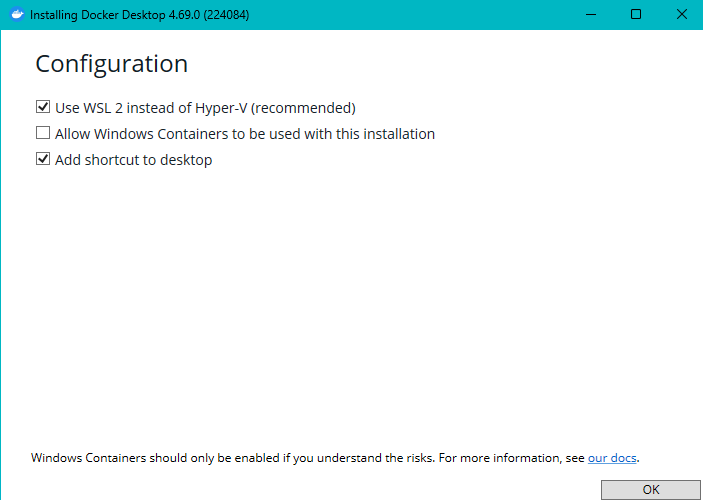

# Claude Code in Docker

A portable Claude Code environment in Docker for Windows. Authenticate once on your host, then launch isolated containers per project with your credentials mounted in.

## What's in the box

| File | Purpose |
|------|---------|
| `Dockerfile` | Builds the image: Node 20 + Python 3 + git + Claude Code CLI |
| `cc.bat` | Starts a container for the current project directory (or reuses an existing one) |
| `ccstop.bat` | Stops and removes the container for the current project directory |
| `auth.bat` | One-time setup: installs Node.js if missing, then runs OAuth login |
| `.dockerignore` | Excludes `.bat` files from the Docker build context |

## Prerequisites

- [Docker Desktop](https://docs.docker.com/desktop/setup/install/windows-install/) installed and running
  
  > **Note:** During Docker Desktop installation, we recommend using **WSL 2 instead of Hyper-V** for better performance:
  > 
  > 
  > 
  > - ✓ Use WSL 2 instead of Hyper-V (recommended)
  > - ✗ Allow Windows Containers (not needed for this project)
  > - ✓ Add shortcut to desktop

- [Node.js](https://nodejs.org/) installed (for initial auth only -- `auth.bat` can install it for you)
- An Anthropic subscription (Pro, Max, Teams, or Enterprise)

## Setup (one-time)

### 1. Get the files

**Option A -- Clone with git:**

```
cd C:\claude-tools
git clone https://github.com/gimenopea/zt-claude-docker.git
cd zt-claude-docker
```

**Option B -- Download as ZIP:**

1. Go to the repo page on GitHub
2. Click the green **Code** button, then **Download ZIP**
3. Extract to `C:\claude-tools\zt-claude-docker`

### 2. Authenticate

```
auth.bat
```

Or manually:

```
npx @anthropic-ai/claude-code
```

Complete the OAuth login in your browser. Credentials are saved to `%USERPROFILE%\.claude\`.

### 3. Map the regression output drive

```
net use R: \\regr3\home\pg\regression-output /persistent:yes
```

> **⚠️🔴 CHANGE `pg` TO YOUR OWN INITIALS! 🔴⚠️**
>
> The path `\\regr3\home\pg\regression-output` uses **pg** as an example. Replace it with your initials (e.g. `\\regr3\home\jd\regression-output` for John Doe).

The `/persistent:yes` flag makes the mapping survive reboots.

### 4. Build the image

> **Important:** Run this from inside the repo folder (where the `Dockerfile` is). The `.` at the end tells Docker to use the current directory as the build context.

```
cd C:\claude-tools\zt-claude-docker
docker build -t claude-code .
```

### 5. Add to PATH (optional but recommended)

Adding the repo folder to your system PATH lets you run `cc` and `ccstop` from any directory without typing the full path.

**Via GUI:**

1. Press `Win + R`, type `sysdm.cpl`, press Enter
2. Go to **Advanced** tab, click **Environment Variables**
3. Under **User variables**, select **Path**, click **Edit**
4. Click **New**, paste the full path to this repo (e.g. `C:\claude-tools\zt-claude-docker`)
5. Click **OK** on all dialogs
6. **Restart any open terminals** -- existing windows won't pick up the change

**Via command line (run as Administrator):**

```
setx PATH "%PATH%;C:\claude-tools\zt-claude-docker"
```

> **Note:** `setx` permanently writes to the registry but does NOT update the current terminal session. Open a new terminal after running it.

**Verify it worked** (in a new terminal):

```
where cc
```

Should print something like `C:\claude-tools\zt-claude-docker\cc.bat`.

## Usage

### Start a session

From any project directory:

```
cc
```

(Or use the full path `C:\claude-tools\zt-claude-docker\cc.bat` if you skipped the PATH step.)

This spins up a container named `claude-<folder>` (or reuses an existing one) and drops you into a bash shell. Then run:

```
claude
```

### Exit the container

When you're done working and want to return to your Windows host terminal:

```
exit
```

Or use the keyboard shortcut:

- **Ctrl + D** — sends EOF signal, exits the bash shell
- **Ctrl + P, Q** — detaches from container without stopping it (container keeps running in background)

> **Tip:** After exiting, the container may still be running in the background. Use `ccstop` to fully stop and remove it, or just run `cc` again to re-enter the same container.

### Stop a session

From the same project directory:

```
ccstop
```

Your project files and credentials are unaffected -- they live on the host via volume mounts.

## How it works

```
HOST (Windows)                         CONTAINER (Linux)
─────────────────                      ──────────────────
%USERPROFILE%\.claude\       ──mount──>  /home/node/.claude/
%USERPROFILE%\.claude.json   ──mount──>  /home/node/.claude.json
C:\your\project\             ──mount──>  /workspace/
```

The container reads your host credentials via bind mounts. No tokens are baked into the image.

## Quick reference

| Command | When |
|---------|------|
| `auth.bat` | First time (installs Node + authenticates) |
| `docker build -t claude-code .` | First time / after Dockerfile changes |
| `cc.bat` | Start working |
| `ccstop.bat` | Done working |
| `claude` | Inside the container |

## Example walkthrough

Say you need to use Claude Code on a ticket branch `T2331_LEE`, which is a copy of the codebase on the `H:` drive.

**1. Open a terminal and navigate to the project:**

```
H:
cd H:\T2331_LEE
```

**2. Start the container:**

```
cc
```

This creates a container named `claude-T2331_LEE` with your project mounted at `/workspace`. You're dropped into a bash shell inside the container:

```
/workspace $
```

**3. Launch Claude Code:**

```
claude
```

Claude Code can now see and modify everything in `H:\T2331_LEE`. Any changes it makes inside `/workspace` are written directly to your `H:` drive -- no copying needed.

**4. When you're done, exit Claude Code and the container:**

```
exit   # exits Claude Code
exit   # exits the container bash shell
```

**5. Stop and clean up the container:**

```
ccstop
```

Your files on `H:\T2331_LEE` are untouched. Next time you run `cc` from that folder, a fresh container is created with the same mounts.

> **Tip:** You can have multiple containers running at once. If you open a second terminal and run `cc` from a different project folder (e.g. `H:\T2400_SMITH`), it gets its own container named `claude-T2400_SMITH` -- completely isolated from the first.

---

## Detailed reference

Everything below is a deep dive into how this project works -- every file annotated line by line, every Docker flag explained. You don't need this to get started, but it's here when you want to understand what's happening under the hood.

### Docker commands & parameters

#### docker build

Builds an image from a Dockerfile.

| Parameter | Example | Purpose |
|-----------|---------|---------|
| `-t` | `-t claude-code` | Tags the image with a name so you can reference it later instead of using a hash ID |
| `.` | `docker build -t claude-code .` | The build context -- tells Docker to look for the Dockerfile in the current directory. Only files not excluded by `.dockerignore` are sent to the build engine |

#### docker run

Creates and starts a new container from an image.

| Flag | Example | Purpose |
|------|---------|---------|
| `-d` | `-dit` | **Detached mode.** Runs the container in the background so it doesn't block your terminal |
| `-i` | `-dit` | **Interactive.** Keeps stdin open even when not attached -- required for later `exec` sessions |
| `-t` | `-dit` | **TTY.** Allocates a pseudo-terminal so you get proper line editing and colors |
| `--name` | `--name claude-my-app` | Gives the container a human-readable name instead of a random one like `angry_darwin` |
| `-v` (bind mount) | `-v "%CD%:/workspace"` | **Volume mount.** Maps a host directory to a container path. Format: `host_path:container_path`. Changes are reflected in both directions in real time |
| `-e` | `-e PS1="\w \$ "` | **Environment variable.** Sets a variable inside the container. Can be used multiple times for multiple variables. |
| `-w` | `-w /workspace` | **Working directory.** Sets which directory you land in when entering the container |

#### docker exec

Runs a command inside an already-running container.

| Flag | Example | Purpose |
|------|---------|---------|
| `-i` | `-it` | **Interactive.** Keeps stdin attached so you can type commands |
| `-t` | `-it` | **TTY.** Gives you a proper terminal with line editing |

```
docker exec -it claude-my-app /bin/bash
```

#### docker ps

Lists running containers.

| Flag | Example | Purpose |
|------|---------|---------|
| `-q` | `docker ps -q` | **Quiet.** Only outputs container IDs. Useful for scripting |
| `--filter` | `--filter "name=claude-my-app"` | Narrows results to containers matching the filter |

#### docker stop & docker rm

| Command | What it does |
|---------|-------------|
| `docker stop <name>` | Sends SIGTERM to the container's main process, waits 10 seconds, then SIGKILL if needed. Graceful shutdown. |
| `docker rm <name>` | Deletes the stopped container. Frees up the name. Does **not** delete volumes or mounted files. |

#### Dockerfile instructions

| Instruction | Example | Purpose |
|-------------|---------|---------|
| `FROM` | `FROM node:20-slim` | Sets the base image. Every Dockerfile starts with this |
| `RUN` | `RUN apt-get install -y git` | Executes a command during image build and saves the result as a new layer |
| `USER` | `USER node` | Switches to a non-root user. Security best practice |
| `WORKDIR` | `WORKDIR /workspace` | Sets the default directory inside the image. Creates it if it doesn't exist |
| `CMD` | `CMD ["/bin/bash"]` | The default command when the container starts. Only the last CMD takes effect |

---

### Project files annotated

#### Dockerfile

```dockerfile
FROM node:20-slim
# Base image. Minimal Debian with Node.js 20 and npm. The -slim variant is
# ~200 MB vs ~1 GB for the full image.

RUN apt-get update && apt-get install -y python3 python3-pip git && rm -rf /var/lib/apt/lists/*
# Install python3, pip, and git. Claude Code uses git heavily for diffs,
# commits, and context. The rm -rf cleans up the apt cache to keep the
# image smaller.

RUN npm install -g @anthropic-ai/claude-code
# Install Claude Code CLI globally so you can run `claude` from anywhere
# in the container.

USER node
# Drop privileges. Switches from root to the built-in node user.
# Claude Code doesn't need root.

WORKDIR /workspace
# Default directory. This is where your project code gets mounted.

CMD ["/bin/bash"]
# Keeps the container alive in detached mode so you can docker exec into
# it later.
```

#### cc.bat

```batch
@echo off
REM Suppress command echo.

for %%I in ("%CD%") do set FOLDER_NAME=%%~nxI
REM Extract current folder name (e.g. "my-app" from C:\projects\my-app).
REM Makes the container name unique per project.

set CONTAINER_NAME=claude-%FOLDER_NAME%
REM Container name becomes claude-my-app. Easy to spot in docker ps.

:: Check if container is already running
docker ps -q --filter "name=%CONTAINER_NAME%" > %TEMP%\cc_check.txt 2>nul
set /p RUNNING=< %TEMP%\cc_check.txt
del %TEMP%\cc_check.txt >nul 2>&1
REM Workaround for batch not supporting command substitution.
REM Writes container ID to a temp file, reads it back, cleans up.

if "%RUNNING%"=="" (
    docker run -dit --name %CONTAINER_NAME% ^
      -v "%CD%:/workspace" ^
      -v "%USERPROFILE%\.claude:/home/node/.claude" ^
      -v "%USERPROFILE%\.claude.json:/home/node/.claude.json" ^
      -e PS1="\w \$ " ^
      -w /workspace ^
      claude-code
)
REM Only creates a new container if one isn't already running.
REM Mounts: your project, credentials directory, and global config.

docker exec -it %CONTAINER_NAME% /bin/bash
REM Opens an interactive bash shell in the container.
```

#### ccstop.bat

```batch
@echo off
for %%I in ("%CD%") do set FOLDER_NAME=%%~nxI
docker stop claude-%FOLDER_NAME% && docker rm claude-%FOLDER_NAME%
REM Stop then remove. Your project files are untouched since they live
REM on the host via the volume mount.
```

#### .dockerignore

```
*.bat
```

Excludes batch files from the Docker build context. They're host-side launchers and don't belong in the image.

---

### How it all connects

```
┌──────────────────────── HOST (Windows) ───────────────────────┐
│                                                                │
│   %USERPROFILE%\.claude\       ← OAuth tokens live here        │
│   %USERPROFILE%\.claude.json   ← Global config                 │
│   C:\your\project\             ← Your code                     │
│                                                                │
│           │  volume mount  │  volume mount  │                  │
│           ▼               ▼               ▼                    │
│                                                                │
│  ┌───────────── CONTAINER (Linux) ──────────────────┐          │
│  │                                                  │          │
│  │   /home/node/.claude/       ← reads host tokens  │          │
│  │   /home/node/.claude.json   ← reads config       │          │
│  │   /workspace/               ← your code, live    │          │
│  │                                                  │          │
│  │   node + python3 + git + claude-code             │          │
│  │                                                  │          │
│  └──────────────────────────────────────────────────┘          │
│                                                                │
└────────────────────────────────────────────────────────────────┘
```

The container reads your host credentials via bind mounts. No tokens are baked into the image.
